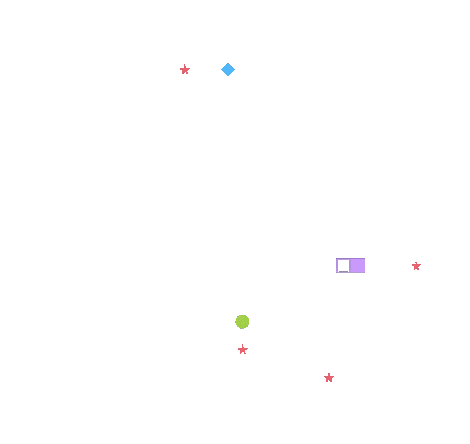

<h1 align="center">🐍 Snither</h1>
<p align="center"><sub>/ˈsnaɪ-ðər/</sub></p>

<p align="center">
  <strong>Slither.io-style battle royale with AI, classic snake, and everything in between - right in your terminal.</strong>
</p>

<p align="center">
  <em>A random project from years ago, remastered.</em>
</p>

<p align="center">
  
</p>

## ⚡ Instant Play

No install. No dependencies. Just paste and play:

```bash
zsh <(curl -sL https://raw.githubusercontent.com/JadXV/snither/main/snither.sh)
```

## Controls

```
     W
   A ● D    Q = Quit
     S
```

## Game Modes

| Mode | Description |
|------|-------------|
| **1. Versus** | Slither.io-style battle royale vs 2 AIs |
| **2. Solo** | Classic snake, just you |
| **3. AI Watch** | Watch the AI play itself |


Snither is written **100% in pure ZSH** - no Python, no Node, no compiled binaries. Just shell.

- **Zero dependencies** - runs on any machine with ZSH out of the box
- **Instant startup** - no interpreter overhead, just raw shell speed
- **Truly portable** - one script, one command, works everywhere ZSH does
- **Lightweight** - no bloated runtimes eating your RAM
- **Something different** - wanted to try building a game with something different then the usual

## Requirements

- ZSH shell (macOS default, or install on Linux)
- Unicode-capable terminal

## 📦 Manual Install

Want to keep it locally? Download, make it executable, and run:

```bash
curl -O https://raw.githubusercontent.com/JadXV/snither/main/snither.sh
chmod +x snither.sh
./snither.sh
```

## Windows or No ZSH? No Problem

On Windows or a system without ZSH, use the Python version:

```bash
python nonZsh/pythonVersion.py
```

## License

MIT
